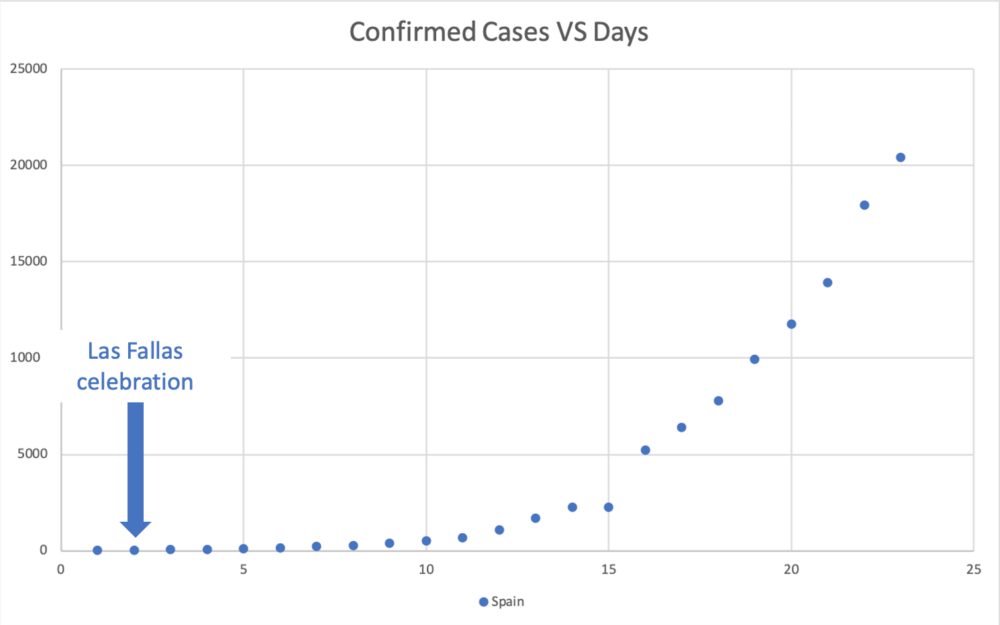

# COVID_19_Cases_Analysis_and_Prediction_Mar_20
## Introductory
The spread of the coronavirus was declared as a pandemic, officials at the World Health Organization said on March 11th, 2020. Dr. Tedros said, "Find, isolate, test and treat every case, and trace every contact." However, on March 11th, what we see in the US is that the government hasn't taken it seriously. There were 1281 confirmed cases in the US on March 11th. On March 20th, this number has grown to 19100. People started to panic shopping toilet papers, food, and water. "COVID 19" has become the most "popular" word recently. We, as a team, wanted to find out what the US government did wrong when containing the virus and what the US need to do to overcome this global pandemic.
## Outline of Research
### Industry Question
Since Covid-19 has developed into a global pandemic, it is clear that every country in the world is fighting the virus. It is important to learn from other countries' lessons and see what works best to contain the virus. In our analysis, we looked at the triggers for the virus outbreak and the methods some countries implemented, which have further been proved effective. By doing so, we are trying to find out what the US can do to contain COVID-19. But more importantly, we are hoping to find out what could be done by countries and the people within when facing with new pandemic in the future.
### Research Methodology
#### Data Needed for Examination
The daily reported confirmed cases globally as time series is important for us to understand the development of the virus. We found the data from a GitHub repository maintained by the [Center for Systems Science and Engineering (CSSE)](https://github.com/CSSEGISandData/COVID-19) at Johns Hopkins University. 
#### Quantitative Research
For quantitative analysis, with the data from Johns Hopkins University, we have the daily reported cases from 1/22/2020 to 3/20/2020. Using these data, we were able to find the beginning of the outbreak and the potential trend of the outbreak. Regarding the data analysis, we mostly used the scatter plot and the forecast sheet function. Since it is a prediction, there isn't right or wrong until we get the actual data for comparison. By comparing the predicted number with the actual number, we found that the actual number met our expectations in most cases. In other words, if the US government does not follow the guidelines given by WHO, the number of confirmed cases will keep growing exponentially.
#### Qualitative Research
After that, we carried out qualitative researches, trying to find out two things. First, connect certain countries with seemingly "sudden" outbreak to some major events that happened before. Secondly, connect certain countries where the situations might be better controlled to their approaches to contain the virus. In this way, we can find the trigger of the outbreak, while understanding what could be done in the US to help overcome the outbreak.
### Data Visualization

### Viable Approach
Social distancing, quarantine, and self-isolation are all proved to be effective in slowing the spreading process. Extensive testing is also important to contain the virus. Countries like China and South Korea are successful examples of these acts. 
### Further Research Possibility
If we were given more time, we would consider predicting the turning point of the coronavirus outbreak. Since the development of the coronavirus is determined by numerous factors such as government policies, people's awareness, and the population density, predicting the turning point becomes extremely difficult. Given the dynamic evolving nature of the coronavirus, it is tough to get to a specific date. 
### Apart from COVID-19
Looking at the increasing speed of the confirmed cases, we can't imagine what will happen if no effective method is in place. Based on our prediction, the number could grow to hundreds of thousands unless the government implements effective methods such as extensive testing and isolation. In these days of globalization, where international travel and cross countries cooperation become more and more frequent, a global pandemic is not just the matter of any individual country. More could be done, and more should be done in the very beginning of what may become an outbreak of a new contagious virus. We should be aware and alert at all times!
## Data Source
* [Novel Coronavirus (COVID-19) Cases, provided by JHU CSSE](https://github.com/CSSEGISandData/COVID-19)
